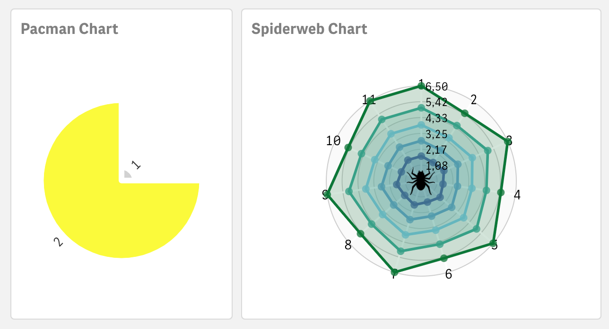

# The Ministry of Silly Charts
  
It is November again, time to make some real fun with Qlik Sense charts. In analogy of what the great Monty Pythons did to walk styles in their "Ministry of Silly Walks", basically I do to data visualizations here. Here I'm presenting this together with my daughter in this colorful fun video!

 - 2020 Video -> https://youtu.be/bBOv334Efcc
 
Included in 2020: The PacMan Chart, the Minecraft Chart, the Tetris Chart, the Empire State Chart, the Country Lane Chart, the London Bridge Chart, 
the Earth Rotation Chart, The Spiderweb Chart, the "Kranz" Chart, the Mandelbrot Chart, and the Qlik Guru Picture.

The app shown in the video is attached <a href="https://github.com/ChristofSchwarz/silly/raw/main/Silly%20Charts%202020.qvf.zip">here as .zip</a> (unzip
first then import in QMC or export to `My Documents\Qlik\Sense\Apps`)

 ## Things you can paint in Qlik Sense when you are bored 
 With the help of the `ValueLoop(...)` or `ValueList(...)` formulas a chart can spin up a dimensionality without data being loaded before. You need a 
 Professional License Type to be able to edit sheets. You got one? Try it out:
 
 
 
 ### The PacMan Chart
 
Start a new Pie Chart by dragging and dropping the pie chart symbol to the sheet.
  - As Dimension put this formula `=ValueLoop(1,2)`
  - Add a 1st Measure `=RowNo()-.5` which will drive the portion of the pie in the ratio 0.5 and 1.5, turning into 90° and 270°
  - Add a 2nd Measure `=RowNo()-.7` which will drive the size of the slice, the first one being much smaller, like 0.3 : 1.3
  - Down at the Appearance accordion section, find Colors and put "By Expression"
  - use this color formula `=Pick(RowNo(),Null(),'#FEFB00')` which will give the small segment a default color and the 2nd segment a yellow color
  - Under "Presentation" go to the advanced Styling and add a Large Outline width in White, so that the segments do not meet each other
  
 ### The Spider Web Chart
 
Start a new "Radar Chart" from the Custom Objects / Qlik Visualization bundle to a Qlik Sense Sheet. Decide how many spokes your spider web should 
have, in the example below it is 11, but you can increase/decrease as you like:
 - As 1st Dimension put `=ValueLoop(1,5)`
 - As 2nd Dimension put `=ValueLoop(1,11)` (here we go for the 11-spokes spider web)
 - As Measure put `=1.5 + Floor((RowNo(TOTAL)-1)/11) + Mod(RowNo(),2)/(5-Floor((RowNo(TOTAL)-1)/11))` (note the 11 again)
 - Under Appearance / Design set the Stroke type to "Straight" and turn off the Legend
 - Want to see the spider in the center? There are a few extra step needed:
     - Pull a "Multi KPI" object to the same sheet.
     - As a Measure add `='spider'` so that the KPI shows the text. It is important to put 'spider' there, otherwise this easteregg will not work :-)
     - Go to Appearance / Styles copy <a href="https://raw.githubusercontent.com/ChristofSchwarz/silly/main/spider.css">this css</a> into the "Styles (CSS)" 
       box found there. The spider will not yet show, two more steps to go!
     - Find out the object id of the spider web chart. Toggle from Edit Mode to Analysis mode and right-click on the spider web
     - Select "Share" and "Embed" -> the object Id is printed just in the Preview window in the upper part. Copy that id to the clipboard.
     - Toggle back to Edit Mode and find back the CSS properties in the Multi KPI object where you pasted the CSS before
     - Replace the `?`(question mark) after `#container_` with the id of the chart, so it reads something like `#container_uvYt:before` ...
     - Now the spider should show. Maybe it takes a browser refresh of that page.
 
 ## Earlier versions
 
 - 2019 video -> https://www.youtube.com/watch?v=risl1RTplzw
 - 
