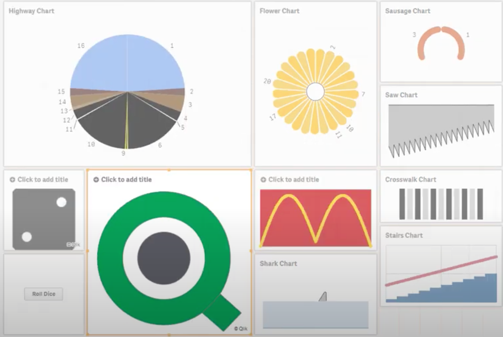

# The Ministry of Silly Charts
  
It is November again, time to make some real fun with Qlik Sense charts. In analogy of what the great Monty Pythons did to walk styles in their "Ministry of Silly Walks", basically I do to data visualizations here. Here I'm presenting this together with my daughter in this colorful fun video!

 - 2020 https://youtu.be/bBOv334Efcc
 
Included in 2020: The PacMan Chart, the Minecraft Chart, the Tetris Chart, the Empire State Chart, the Country Lane Chart, the London Bridge Chart, 
the Earth Rotation Chart, The Spiderweb Chart, the "Kranz" Chart, the Mandelbrot Chart, and the Qlik Guru Picture.

The app shown in the video is attached here as .zip (unzip first then import in QMC or export to `My Documents\Qlik\Sense\Apps`)
 
 
 ## Earlier versions
 
 - 2019 https://www.youtube.com/watch?v=risl1RTplzw
 - 
